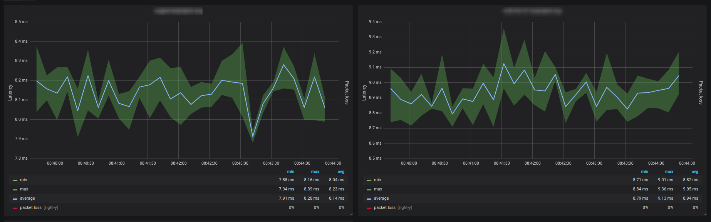
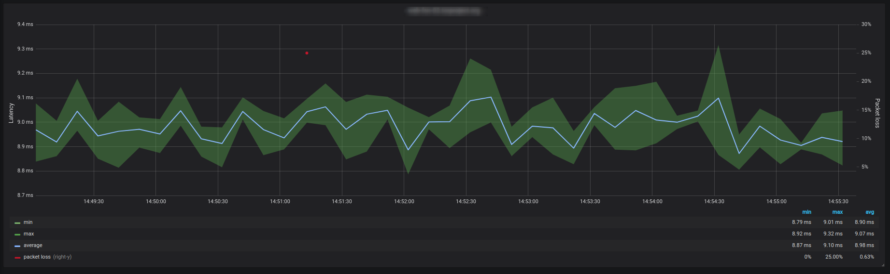

# network-latency
Track network latency with Telegraf, InfluxDB and Grafana

## Dependencies

* [docker](https://docs.docker.com/install/)
* [docker-composer](https://docs.docker.com/compose/install/)

## Usage

* `git clone git@github.com:mbelloiseau/network-latency.git`
* `cd network-latency`
* edit config/telegraf/telegraf.conf and modify **urls**
* `docker-compose up -d`
* use your favorite browser and go to [Grafana](http://localhost:3000)

## Resources

* https://github.com/influxdata/telegraf/tree/master/plugins/inputs/ping
* https://docs.influxdata.com/influxdb/v1.7/tools/api/#ping-http-endpoint
* https://grafana.com/docs/administration/provisioning/
